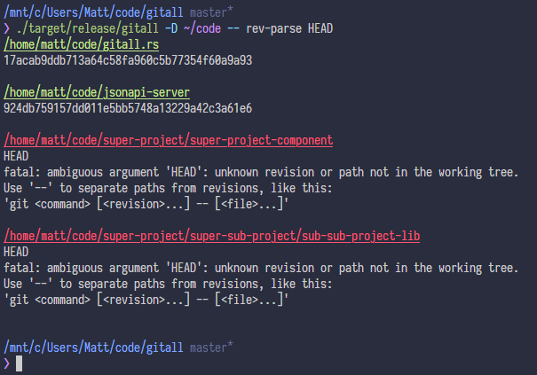

# gitall

gitall recursively finds all repositories below a directory and runs the given [Git][] command in each repository in parallel.

[](https://github.com/mattmahn/gitall.rs/actions/workflows/ci.yml)
[](https://docs.rs/gitall)


## Usage

The simplest form is to `cd` to a directory containing all the repos you want to operate on, then write your Git command changing `git` to `gitall`.
To pass options to the Git command, you must add `--` before your command to tell gitall to stop parsing its own options and pass them to Git.
For example, to list all remote and local repository branches you need to run `gitall -- branch -va`.

**Pro Tip:** if you add a file called `git-foo` to your `PATH` (either via copying or symlinking), you can call that program _through_ `git` using `git foo`; no additional aliases or setup needed.
So, after running `ln -s /usr/bin/gitall /usr/bin/git-all`, you can use gitall via `git all` exactly the same as if you used `gitall`.


### Examples

Print the latest commit SHA:



Fetch the latest changes for all your repositories under `~/code`:
```console
$ cd ~/code
$ gitall fetch origin
/home/matt/code/gitall.rs
From github.com:mattmahn/gitall.rs
   17acab9..8994d3c  master     -> origin/master
 * [new branch]      windows-build -> origin/windows-build

/home/matt/code/jsonapi-server
From github.com:holidayextras/jsonapi-server
 * [new branch]      greenkeeper/debug-4.1.1 -> origin/greenkeeper/debug-4.1.1
 * [new branch]      greenkeeper/eslint-plugin-node-8.0.0 -> origin/greenkeeper/eslint-plugin-node-8.0.0
 * [new branch]      greenkeeper/jscpd-0.6.25 -> origin/greenkeeper/jscpd-0.6.25
 * [new branch]      greenkeeper/jscpd-1.0.0 -> origin/greenkeeper/jscpd-1.0.0
 * [new branch]      greenkeeper/jscpd-1.0.1 -> origin/greenkeeper/jscpd-1.0.1
 * [new branch]      greenkeeper/jscpd-1.0.2 -> origin/greenkeeper/jscpd-1.0.2
 * [new branch]      greenkeeper/jscpd-1.0.3 -> origin/greenkeeper/jscpd-1.0.3
 * [new branch]      greenkeeper/jscpd-1.1.0 -> origin/greenkeeper/jscpd-1.1.0
 * [new branch]      greenkeeper/jscpd-1.2.0 -> origin/greenkeeper/jscpd-1.2.0
 * [new branch]      greenkeeper/jscpd-1.2.1 -> origin/greenkeeper/jscpd-1.2.1
 * [new branch]      greenkeeper/jscpd-1.2.2 -> origin/greenkeeper/jscpd-1.2.2
 * [new branch]      greenkeeper/jscpd-1.2.3 -> origin/greenkeeper/jscpd-1.2.3
 * [new branch]      greenkeeper/jscpd-2.0.0 -> origin/greenkeeper/jscpd-2.0.0
 * [new branch]      greenkeeper/jscpd-2.0.1 -> origin/greenkeeper/jscpd-2.0.1
 * [new branch]      greenkeeper/jscpd-2.0.2 -> origin/greenkeeper/jscpd-2.0.2
 * [new branch]      greenkeeper/jscpd-2.0.3 -> origin/greenkeeper/jscpd-2.0.3
 * [new branch]      greenkeeper/jscpd-2.0.4 -> origin/greenkeeper/jscpd-2.0.4
 * [new branch]      greenkeeper/qs-6.6.0 -> origin/greenkeeper/qs-6.6.0
 * [new branch]      mast       -> origin/mast
```
Alternatively, you can run `gitall -D ~/code fetch origin` from any directory.


### Options

```
Executes git(1) commands in repos below a parent directory

USAGE:
    gitall [FLAGS] [OPTIONS] <COMMAND>...

FLAGS:
    -L, --follow
            When specified, symbolic links will be followed when navigating the directory tree.

        --full-path
            By default, REGEX matches against only the directory name. Using this flag, REGEX matches against the full
            canonical path.
    -h, --help
            Prints help information

    -V, --version
            Prints version information


OPTIONS:
        --color <WHEN>
            Controls when to use color [default: auto]  [possible values: always, true, auto, never, false]

    -D, --directory <DIR>
            The directory to start searching under [default: .]

    -X, --executable <PROGRAM>
            The program to run in each repo [default: git]

    -d, --max-depth <LEVELS>
            Descend at most LEVELS of directories below DIR

    -r, --regex <REGEX>
            Filters command to repo(s) matching provided regular expression [default: .*]

    -j, --threads <NUM>
            The maximum number of commands to run in parallel


ARGS:
    <COMMAND>...
            A single git command to run in each repo
```

## Installation

Dependencies:
  - Git
  - Rust & Cargo (for build only)

You can install gitall from [crates.io][] with
```console
$ cargo install gitall
```

Or download pre-built binaries for some platforms on the [releases][] page.
After extracting the release artifacts, move the `gitall` executable to some directory in your `PATH`.
Refer to your shell's documentation for installing the completion scripts located in `complete/`.


### From source

Clone this repository, build gitall, then copy the executable to a directory in your `PATH`:
```console
$ git clone https://github.com/mattmahn/gitall.rs && cd gitall.rs
$ cargo build --release
# install target/release/gitall /usr/bin/
```

Shell completions for Bash, Zsh, fish, Elvish, and PowerShell are also generated during build; you can find them at `target/release/build/gitall-<hash>/out/`.
Refer to your shell's documentation for installation.


[crates.io]: https://crates.io/
[Git]: https://git-scm.com/
[releases]: https://github.com/mattmahn/gitall.rs/releases
